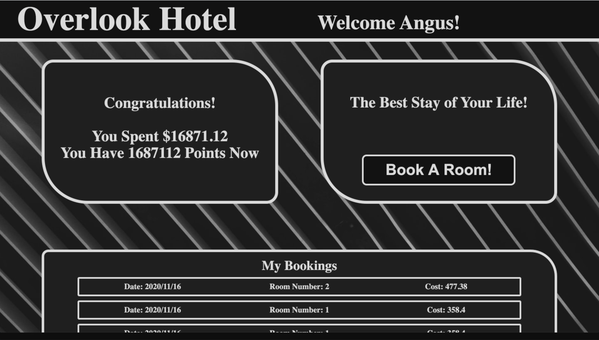
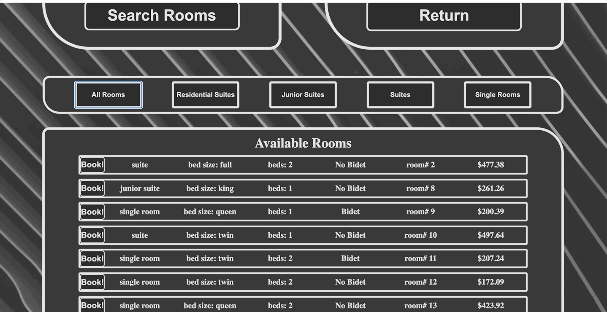
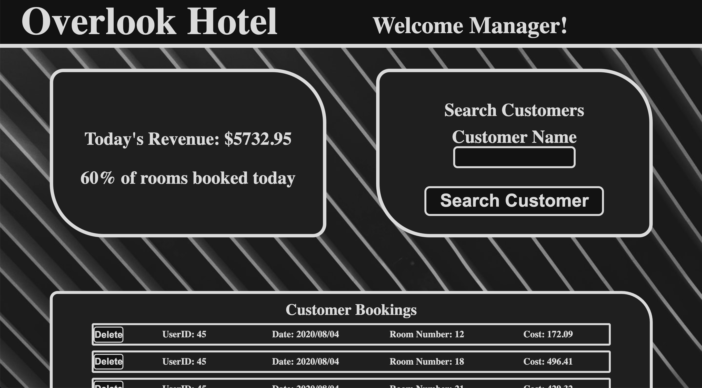

# Overlook

## About The Project
* Overlook is a site for navigating a fictional hotel's webpage. A user can log in as a manager or one of 50 pre made customers. The manager can see the hotel's stats for the data along with any bookings for the day. A manager can search for a customer and either book them a room or delete a booking. The customer can see their total expenses and upcoming bookings. They can search for rooms by date and room type before booking a room. All booking information is posted, retrieved or deleted from a server.
* Overlook is the final project of 2nd module (12 weeks into program) of Turing School of Software Engineering. It is the first project to require fetching, spies testing, object inheritance and WebPack.
* This Project Uses:
  * HTML
  * Javascripts
  * CSS/SCSS
  * Chai/Mocha Testing
  * WebPack

## Installation
**Fork This Repository**
https://github.com/jordy1611/Overlook

**Clone Your Forked Repository**
`git clone` and the copied URL

**Change into the directory and install the project dependencies**
`cd` into directory and run `npm install` for dependencies

## Usage
### Customer
* Customer can log in with Customer id and password

* Customer can see their total spent at the hotel and all of their bookings

* Customer can search for rooms and filter rooms by date

* Customer can further filter rooms by room type

* Customer can book a room

* Customer can return to their main dashboard

### Manager
* Manager can log in with manager id and password

* Manager can view today's revenue, % of rooms booked and all bookings today

* Manager can search customer by name

* Manager can search rooms for customer by date

* Manager can book a room for a customer

* Manager can return to the main manager page

## Roadmap

See the [open issues](https://github.com/jordy1611/Overlook/issues) for a list of proposed features (and known issues).

## Main Contributor
- Jordan Shryock
  - jordan.m.shryock@gmail.com
  - [Jordan's Linkedin](https://www.linkedin.com/in/jordan-shryock-6a48b9113/)
